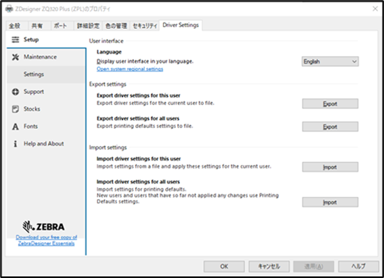
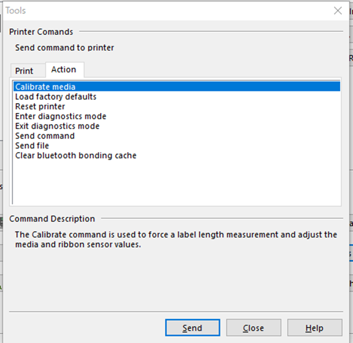

## Windows ドライバのモード（ZPL、CPCL）を切り替える方法

-----
 

ゼブラモバイルプリンタ向けのドライバは下記の通りZPLとCPCLの２種類が存在します。どちらのドライバにおいてもほぼ同等の機能を実装しています。

Windows によって、どちらがCPCLモード自動選択されるかはプリンタ内部のpnp_optionモードによって決まります。任意のドライバ形式に切り替える場合は下記表の設定コマンドを実施ください。

<table border="2">
<tr>
<th>
 
ZPLモード向けドライバ
 
 
</th>
<th>
CPCLモード向けドライバ
</th>
</tr>
<tr>
<td>

</td>
<td>

</td>
</tr>
<tr>
<td>
 
設定コマンド： 
! U1 setvar "device.pnp_option" "zpl" 
 
確認コマンド： 
! U1 setvar "device.pnp_option" 

</td>
<td>
 
設定コマンド： 
! U1 setvar "device.pnp_option" "cpcl" 
 
確認コマンド： 
! U1 setvar "device.pnp_option" 
</td>
</tr>

</table>
